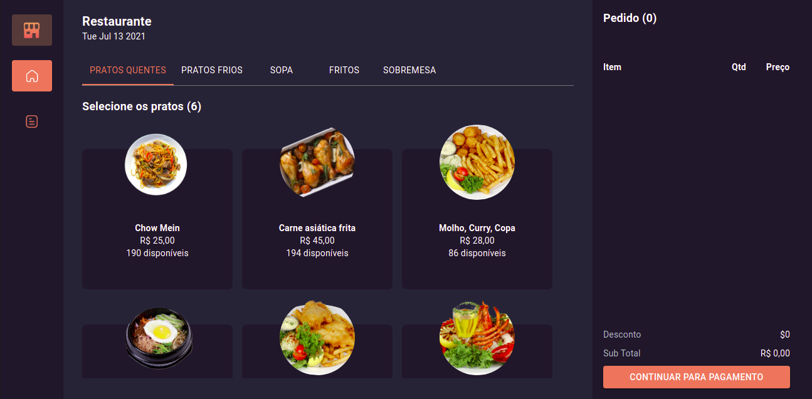
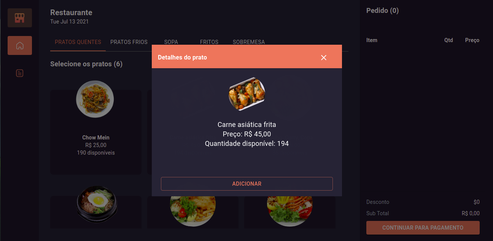
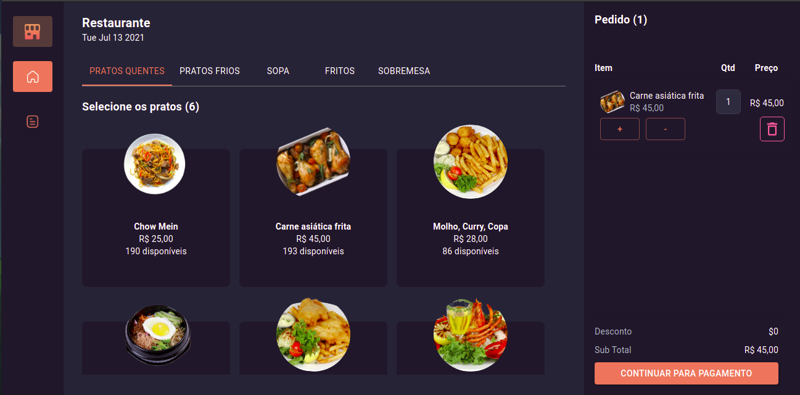

# Restaurant App :hamburger::computer::iphone:

Um site feito em NextJs utilizando o framework Material UI, para gerenciamento de pedidos de um restaurante.

# Requisitos:
- NodeJs >= 12
- Npm >= 6

# Instalação

Após baixar o projeto entre nas pastas `menu-restaurant-api` e `menu-restaurant-app` abra o terminal e digite `npm install` para baixar as dependências necessárias para o projeto

# Execução

Após a configuração do projeto, é necessário executar a api e o app, para visualizar o projeto, então:

- Na api execute `npm run develop`
- No app execute `npm run dev`

Após isso, abre em seu navegador `http://localhost:3000`, para visualizar a aplicação rodando

# Aplicação

 A aplicação possui uma tela principal, com o menu para seleção do cliente, podendo filtrar pela categoria escolhida 

Ao clicar em um item é exibido um modal especificando alguns detalhes do prato selecionado, e possibilitando o usuário adicionar ao carrinho.

Assim o pedido irá aparecer nos pedidos, possibilitando aumentar e diminuir a quantidade, bem como excluir o item do pedido

